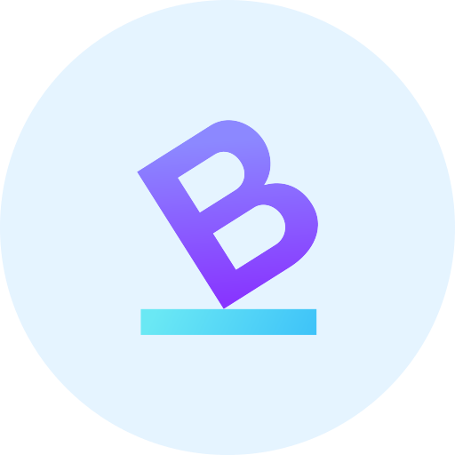

<h1 align="center">Balance Mobile App</h1>
 

 

# Table of contents

- [Introduction](#introduction)
- [Installation](#installation)
  - [Flutter](#flutter)
- [Authors](#authors)
- [License](#license)
  - [Third-party component licenses](#third-party-component-licenses)

# Introduction

Balance is an effort of Computer Science researchers at the University of Urbino with the
aim of providing a tool to measure your posture in a few seconds, with your smartphone.

It is part of the Industrial PhD scholarship funded by Marche Region in the name of Gioele Bigini.
The PhD is a joint initiative of the University of Urbino, Politecnica delle Marche, TU Wien
and the company Digit Srl.

# Installation

This project is build in Flutter and published in the Apple App Store and Google Play Store.

# Authors

- Emanuele Lattanzi, Associate Professor @ University of Urbino.
- Valerio Freschi, Researcher @ University of Urbino.
- Gioele Bigini, PhD Student @ University of Urbino.

For the full list of Collaborators, Partners and Sponsors, please visit the official website at:
[Balance Mobile](https://www.balancemobile.it)

# License

The licence for this repository is a [GNU Affero General Public Licence version 3](https://www.gnu.org/licenses/agpl-3.0.html) (SPDX: AGPL-3.0).
Please see the [LICENSE](LICENSE) file for full reference.

## Third-party component licenses

The project make use of several third-party libraries but fully OpenSource. The specific list of
libraries used are shown in the Open Source section visible in the Settings section of the
mobile application.
